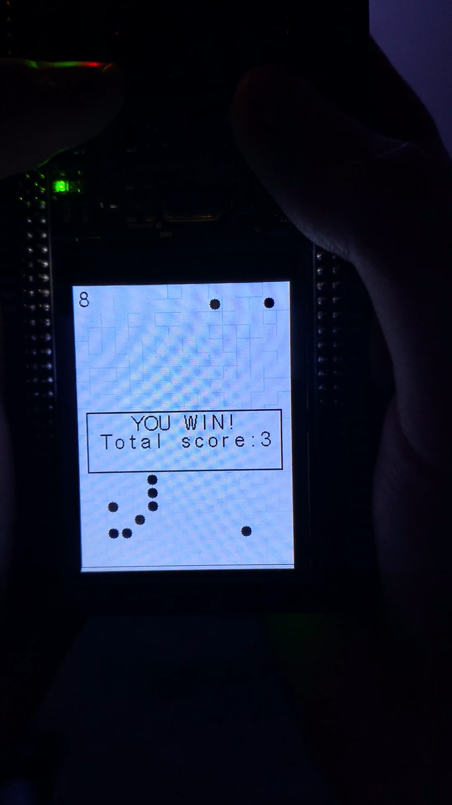

# Labyrinth Game
An advanced spin on the classic marble labyrinth game, built on the STM32F429i platform using FreeRTOS. This real-time embedded project simulates a drone navigating a dynamically generated maze, integrating physics-based motion, quantum tunneling mechanics, and interactive feedback through LEDs and an LCD UI.

## Click to watch the demo:

